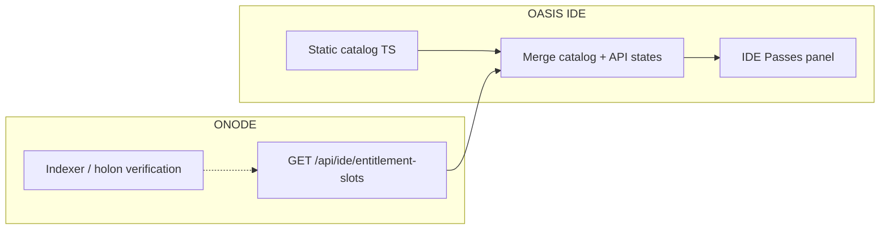

# NFT entitlement slots (IDE)

This document specifies the **IDE Passes** view in OASIS IDE: a fixed grid of **product SKUs** (slots). Each slot describes an on-chain pass that can unlock IDE features. When a linked wallet holds the required NFT, the slot shows **active** after server verification.

**Related:** [ONCHAIN_IDE_CHAIN_READINESS_AND_ENTITLEMENTS.md](./ONCHAIN_IDE_CHAIN_READINESS_AND_ENTITLEMENTS.md) (chain tiers, JWT entitlement model).

---

## 1. Goals

- Show **every SKU we sell** in one place, even if the user does not hold the NFT (empty slot).
- Prefer **entitlement-first** UX: not a raw wallet inventory of all tokens.
- Use the **same catalog** for labels and the **same state** for enforcement (ONODE-issued claims later; see §6).

---

## 2. Terminology

| Term | Meaning |
|------|---------|
| **SKU** | Stable string id (e.g. `solana-builder-pass`). Maps to catalog copy and `onChainRules` on the server. |
| **Slot** | One row/card in the UI = one SKU. |
| **State** | `locked` (not held or not verified), `active` (held and verified), `pending` (re-check in progress or indexer lag). |
| **Catalog** | Off-chain definitions: title, description, unlock summary, category, feature flags. Versioned (`catalogVersion`). |

---

## 3. Architecture

1. **Catalog** lives in the IDE (`src/shared/entitlementSlotsCatalog.ts`) as the source of truth for **display** until a hosted catalog endpoint exists.
2. **ONODE** returns **per-SKU states** for the authenticated avatar (`states` map). Empty or missing keys mean `locked`.
3. **Phase 2:** verification reads linked wallet addresses, uses indexer or OASIS NFT reads, and fills `active` / `pending`. JWT claims (`ent`, `chains`) align with the same feature flags (see existing entitlements doc).

---

## 4. API contract

### `GET /api/ide/entitlement-slots`

**Auth:** `Authorization: Bearer <JWT>` (same session as IDE login). If missing or invalid, **401**.

**Response (JSON, camelCase):**

| Field | Type | Description |
|-------|------|-------------|
| `catalogVersion` | string | Must match or exceed client catalog; client may warn if mismatched. |
| `generatedAt` | string | ISO-8601 UTC. |
| `avatarId` | string | Authenticated avatar GUID. |
| `states` | object | Keys = SKU ids; values = `{ "status": "locked" \| "active" \| "pending", "verifiedAt"?: string, "walletAddress"?: string, "chain"?: string, "tokenId"?: string }`. |

**Phase 1 behaviour:** ONODE returns `states: {}` for every authenticated user (all slots locked until indexer and catalog wiring ship).

---

## 5. IDE behaviour

- **Activity bar:** Opens full-width **IDE Passes** panel (same pattern as STARNET dashboard).
- **Base URL:** `settings.oasisApiEndpoint` if set, else `http://127.0.0.1:5003`.
- **Refresh:** Re-fetches `GET /api/ide/entitlement-slots`. Show error banner if network or 401 (prompt login).
- **Merge rule:** For each catalog entry, `effectiveStatus = states[skuId]?.status ?? 'locked'`.

---

## 6. SKU list (initial catalog)

| SKU id | Category | Unlocks (product intent) |
|--------|----------|---------------------------|
| `founder-annual` | access | Founder Annual IDE access (commercial; see business plan). |
| `founder-lifetime-ga` | access | Founder Lifetime (GA baseline) access. |
| `solana-builder-pass` | chain | Solana mint workflows, Solana defaults, Solana-scoped MCP actions. |
| `evm-core-pass` | chain | EVM Tier-A mint workflow (Ethereum, Base, Arbitrum, Polygon, Optimism, Avalanche, BNB, Fantom). |
| `geonft-studio-pass` | oasis | GeoNFT place/read tooling and geo-focused recipes. |
| `starnet-publisher-pass` | oasis | STARNET publish / activate / republish (mutating `star_*` where gated). |
| `game-content-studio-pass` | oasis | Quest, mission, NPC, item write flows vs read-only discovery. |
| `voice-studio-pass` | integration | ElevenLabs MCP tools (tiered in product). |
| `unity-bridge-pass` | integration | Unity MCP bridge tools. |
| `partner-season-badge` | community | Cosmetic or bundled perks (optional). |

**Note:** Enforcement of MCP tools by SKU is **not** implemented in the IDE agent allowlist until ONODE issues scoped JWTs or the executor checks entitlements; this spec covers **visibility and API shape** first.

---

## 7. Document history

- **2026-04-19:** Initial spec, **IDE Passes** activity view (`EntitlementSlotsPanel`), client catalog and `fetch` merge, Phase 1 ONODE `GET /api/ide/entitlement-slots` (empty `states`).
