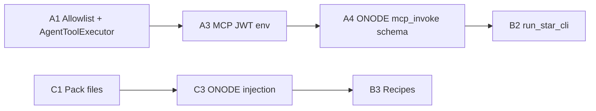

# Build plan: OAPP + STAR agent capabilities (IDE + ONODE)

This plan implements three improvements discussed for **OASIS-IDE** Composer **Agent** mode so users can build **OASIS Applications (OAPPs)** with a **holonic STAR ODK** story without re-explaining the stack each time.

| # | Theme | Outcome |
|---|--------|---------|
| **2** | MCP bridge | Agent can call **allowlisted** OASIS + STAR tools (same behaviour as unified MCP). |
| **3** | STAR CLI bridge | Agent can run **documented** non-interactive STAR CLI flows (`--json` / `-n`) as the single source of truth for codegen. |
| **4** | Context pack | Agent receives a **bounded, versioned** slice of API + CLI docs so answers match real endpoints. |

**Architecture invariant** (do not violate): workspace filesystem and subprocess side effects stay in the **Electron main process**; ONODE holds LLM keys and returns **tool_calls** only. See [`OASIS_IDE_PARITY_ROADMAP.md`](./OASIS_IDE_PARITY_ROADMAP.md).

---

## Prerequisites

1. **MCP built**: `MCP/` has `npm run build`; `OASIS_MCP_SERVER_PATH` optional if monorepo layout is used.
2. **Auth for ONODE tools**: MCP `oasis_*` write paths expect JWT (`OASIS_API_KEY` / `OASIS_JWT_TOKEN` in MCP env). IDE must **inject the logged-in user’s token** into the MCP child environment (or a dedicated proxy) when the agent invokes MCP—not only rely on static `.env`.
3. **STAR WebAPI**: `STAR_API_URL` must match a running STAR WebAPI (port differs by `launchSettings.json`; see `STAR ODK/docs/STAR-WebAPI-Holons-Zomes.md`).

---

## Workstream A — `mcp_invoke` (point 2)

**Goal:** `AgentToolExecutor` exposes a tool the model can call (name TBD: `mcp_invoke` or `call_oasis_star_tool`) that forwards to `MCPServerManager.executeTool` with a **fixed allowlist**.

### A1. Allowlist design

- Maintain `AGENT_MCP_ALLOWLIST` in one module (e.g. `src/main/services/agentMcpAllowlist.ts`).
- **V1 OAPP-focused set** (extend later):
  - OASIS: `oasis_health_check`, `oasis_get_holon`, `oasis_save_holon`, `oasis_authenticate_avatar` (if needed for refresh only—prefer IDE session), search/load helpers as read-only where safe.
  - STAR: `star_get_status`, `star_ignite`, `star_beam_in`, `star_list_oapps`, `star_get_oapp`, `star_create_oapp`, `star_update_oapp`, `star_list_holons`, `star_get_holon`, `star_create_holon`, publish-related `star_*` only if MCP implements them with clear semantics.
- Reject any name not on the list with an explicit tool error (no silent fallback).

### A2. Implementation

- **`AgentToolExecutor`**: new case, e.g. `mcp_invoke`, args `{ "tool": string, "arguments": object }`; validate allowlist; call injected `MCPExecutor` (interface) so tests can mock.
- **`index.ts`**: construct `AgentToolExecutor` with `mcpManager` (or a thin wrapper) passed in.
- **Result shape**: normalise MCP `callTool` content blocks to a single UTF-8 string for the agent chain (same as other tools), cap size (e.g. 256KB), set `isError` on MCP/tool failure.

### A3. MCP child environment (JWT)

- **`MCPServerManager`**: extend `StdioClientTransport` (or equivalent) to pass `env: { ...process.env, OASIS_API_URL, OASIS_JWT_TOKEN: <from AuthStore> }` when starting or **restart MCP** on login/logout so `oasis_save_holon` uses the correct avatar.
- Document: agent mode requires login for mutating OASIS tools.

### A4. ONODE tool schema

- **`IdeAgentController.BuildToolDefinitions()`**: add OpenAI function schema for `mcp_invoke` (or split into 2–3 grouped tools if token budget is tight—prefer one generic tool for v1).
- **`BuildAgentSystemPrompt`**: one short paragraph: “For OASIS persistence use `mcp_invoke` with `oasis_save_holon`; for STARNET OAPP/holons use `star_*` tools via `mcp_invoke`…” plus link to context pack id.

### A5. Acceptance criteria

- [ ] From Agent mode, a scripted test (or manual checklist) calls `mcp_invoke` → `oasis_health_check` and returns healthy.
- [ ] Logged-in user: `oasis_get_holon` / `oasis_save_holon` round-trip against a test holon in dev ONODE.
- [ ] STAR WebAPI up: `star_list_oapps` via `mcp_invoke` returns data or empty list without crashing IDE.
- [ ] Non-allowlisted tool name returns clear error; never forwards arbitrary tool names.

---

## Workstream B — STAR CLI bridge (point 3)

**Goal:** Reuse **STAR CLI** scripted flows from [`Docs/Devs/STAR_CLI_NonInteractive.md`](../../Docs/Devs/STAR_CLI_NonInteractive.md) and the command map in [`Docs/Devs/STAR_CLI_Comprehensive_Guide.md`](../../Docs/Devs/STAR_CLI_Comprehensive_Guide.md) instead of duplicating logic in prompts.

### B1. Resolve CLI entry

- Config: `STAR_CLI_PATH` → path to `star` executable **or** `dotnet` + project file for `dotnet run --project "…STAR.CLI…"`.
- Startup validation (optional): log warning if not found; Composer status pill shows “STAR CLI missing”.

### B2. Tool design (choose one for v1)

- **Option 1 (minimal):** extend `run_workspace_command` allowlist to include `star` and `dotnet` only when argv matches safe prefixes (fragile).
- **Option 2 (recommended):** new tool `run_star_cli` with args:
  - `argv`: string array, first token must be literal `star` or a resolved absolute path to the STAR CLI binary.
  - `cwd`: workspace-relative (default `.`).
  - `timeoutMs`: cap (e.g. 600000).
  - Optional `env`: only allowlisted keys (`STAR_NON_INTERACTIVE`, etc.) copied from a fixed set—**no** free-form env from the model.
- Internally: `spawn` with `shell: false`, same output caps as `run_workspace_command`.

### B3. Documented recipes

- Add `OASIS-IDE/docs/recipes/` (or under this plan) **2–3 JSON recipes** the agent is told to use:
  - “Create OAPP shell” (non-interactive flags per current CLI).
  - “Light generation from DNA file” (if applicable).
- Agent system prompt: “Prefer `run_star_cli` with recipe X; do not invent flags—read recipe file in workspace.”

### B4. ONODE

- Add `run_star_cli` (or reuse generic run command) to `BuildToolDefinitions` and prompt line referencing recipes.

### B5. Acceptance criteria

- [ ] With STAR CLI configured, agent runs one recipe and produces stdout + `exit_code` in the tool result.
- [ ] Failure modes: missing binary, wrong cwd, timeout—all return `isError` with message, no hang.
- [ ] Security: model cannot pass `shell: true` or arbitrary env; argv[0] constrained to `star` / approved path.

---

## Workstream C — Context pack (point 4)

**Goal:** Inject a **bounded** text bundle so the model does not hallucinate ONODE vs STAR URLs or missing OAPP routes.

### C1. Pack contents (versioned)

- Ship under e.g. `OASIS-IDE/resources/agent-context/` or copy into `dist` at build time:
  - `CONTEXT_VERSION.txt` (semver).
  - `star-holons-zomes-api.md` — excerpt or full [`STAR ODK/docs/STAR-WebAPI-Holons-Zomes.md`](../../STAR%20ODK/docs/STAR-WebAPI-Holons-Zomes.md) (trim examples if over budget).
  - `star-cli-overview.md` — short excerpt from [`Docs/Devs/STAR_CLI_Comprehensive_Guide.md`](../../Docs/Devs/STAR_CLI_Comprehensive_Guide.md): beam-in, `oapp` / `holon` / `zome` namespaces, `light`, non-interactive pointer.
  - `onode-data-holons.md` — generated or hand-maintained list: `/api/data/save-holon`, search, specialised `create-*-oapp` if present; note `OAPPController` commented state so agents do not invent `/api/oapp/*`.
- **Total budget**: e.g. ≤ 24k tokens equivalent (~96k chars); enforce at pack build time with a small script or CI check.

### C2. Injection points

- **IDE → ONODE**: extend `agentTurn` body with optional `contextPack?: string` or `contextPackId` + server loads file (prefer **server-side** injection so the client does not exceed POST size). If server-side: add ONODE endpoint or embed hash in `IdeAgentTurnRequest`.
- **Minimal v1:** IDE reads pack from disk in main, appends to first user message or a synthetic `system` slice **only for agent turns** (coordinate with ONODE: avoid duplicating system if ONODE prepends system already—today ONODE prepends system; either merge into ONODE only or send as first user block “Reference:”).

### C3. ONODE

- **`IdeAgentTurnRequest`**: add optional `ContextPack` string (max length server-side).
- **`BuildAgentSystemPrompt`**: append `request.ContextPack` when non-empty; reject over limit with 400.

### C4. Acceptance criteria

- [ ] Agent answers “What port is STAR?” consistently with pack content.
- [ ] Pack version visible in Composer debug or logs for support.
- [ ] Request over max size rejected with clear error.

---

## Recommended order of execution

Rationale: **MCP + JWT** unlocks OASIS/STAR API actions first; **context pack** reduces bad calls; **STAR CLI** builds on stable spawn infrastructure and recipes.

---

## Testing matrix (lightweight)

| Area | Test |
|------|------|
| MCP allowlist | Denied tool returns error; allowed tool succeeds |
| Auth | Logout clears MCP env; save-holon fails until login |
| STAR CLI | Recipe exits 0 on sample workspace; missing CLI surfaces error |
| Context | Strip pack → model regresses on port question (smoke) |

---

## Risks and mitigations

| Risk | Mitigation |
|------|------------|
| MCP token leakage in logs | Never log full JWT; redact in tool results if echoed |
| Huge tool outputs | Hard cap + truncate message |
| STAR CLI drift vs docs | Recipes + `CONTEXT_VERSION`; CI grep for deprecated flags |
| Duplicate system prompt (IDE + ONODE) | Single owner for pack append (prefer ONODE only) |

---

## Relation to existing roadmap

| [`OASIS_IDE_PARITY_ROADMAP.md`](./OASIS_IDE_PARITY_ROADMAP.md) item | This plan |
|-------------------------------------------------------------|-----------|
| Phase 2 `mcp_invoke` | Workstream **A** |
| Phase 2 `run_terminal_cmd` | Partially done as `run_workspace_command`; **B** extends for STAR |
| Phase 3 context / `.oasiside/rules.md` | Workstream **C** (pack is the first slice; repo-specific rules later) |

---

## Ownership (suggested)

- **IDE (TypeScript):** `AgentToolExecutor`, `MCPServerManager`, `OASISAPIClient` / preload if new IPC, pack files, recipes.
- **ONODE (C#):** `IdeAgentController` tool defs + prompt + optional `ContextPack` on request DTO.
- **Docs:** keep [`STAR_CLI_NonInteractive.md`](../../Docs/Devs/STAR_CLI_NonInteractive.md) aligned when recipe flags change.

---

*Created: 2026-04-07. Next step: implement A1–A3 in the IDE, then A4/C3 on ONODE in the same release train so tool names and prompt stay in sync.*
