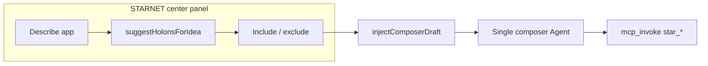

# STARNET OAPP builder — build plan

## Current architecture (2026)

- **One composer** (right panel, session `main`). STARNET does **not** open a second chat.
- **Catalog context** — `StarnetDashboard` pushes `StarnetCatalogSnapshot` via `StarnetCatalogContext`; `ComposerSessionPanel` injects bounded markdown (`starnetAgentContext.ts`) into every agent turn alongside `getAgentContextPack()`.
- **Draft bridge** — Row **Chat** and other actions use `IdeChatContext.injectComposerDraft` to fill the composer textarea (no auto-send).
- **Heuristic matcher** — `starnetHolonSuggest.ts` (`suggestHolonsForIdea`): token overlap on holon name, description, type label; fallback to template rows.
- **Create OAPP** — MCP `star_create_oapp` + `.star-workspace.json` merge (see Phase C and `parseStarMcpOappCreate.ts` / `starWorkspaceMerge.ts`).
- **Removed** — `StarnetComposerToolbar.tsx` (composer-only strip). STARNET UX copy lives in the **STARNET** activity + agent context pack (`IDE-embedded STARNET` in `agentContextPack.ts`).

## Product intent

Users describe an app in plain language, see **recommended holons/OAPPs** grounded in their real catalog, adjust the selection, then continue in the **same composer** so the agent can verify with `mcp_invoke` / `star_*` and scaffold or wire an OAPP. The **center STARNET area** is the planning surface; the composer remains the single agent thread.

### Layout contract — right-panel chat/composer never goes away

- The **existing IDE chat / Composer** stays exactly where it is today: **right panel** (same tab strip as Inbox / Tools / etc., with **Composer** selected — the scrollable thread + input users already use, often described as bottom-right in the default layout).
- Any new STARNET **center** tab (working name **Build** — holon match / “describe your app”) is **not** a replacement chat. It does **not** host a second message list or agent loop.
- That center UI only **prepares** work (rank, select, optional graph preview) and **writes a draft** into the **same** Composer input via `injectComposerDraft`, or nudges the user to send from there. **All sends and agent turns remain in the right-panel Composer.**
- Naming: avoid calling the center tab **“Compose”** if it collides mentally with the right-panel **Composer** tab; use **Build**, **Match**, or **Plan** unless we add explicit UI copy: *“Opens in the Composer on the right →”*.

## Guiding principles

1. **Ground truth from STAR** — Suggestions only use rows already loaded (instances + OAPPTemplate merge) unless the user explicitly runs Agent tools for live lists.
2. **User always confirms** — Default path places a **draft** in the composer (or a one-shot “Continue in composer” payload); no silent auto-send.
3. **Progressive enhancement** — Ship local `suggestHolonsForIdea` first; optional LLM rerank later using the same bounded catalog as context.
4. **Stay in the IDE** — No external “STARNET portal” for browsing; Activity bar → **STARNET** + Agent tools for authoritative ids.

---

## Sketch: STARNET composition builder (next feature)

This section is the **UX + engineering sketch** for a dedicated **“describe app → pick holons → hand off to composer”** flow, including a path toward the **“holons combine in a view”** idea without a second chat.

### Problem

Lists alone do not answer: *“Given my sentence, which holons compose my OAPP, and how do they relate?”* The agent can emit `<oasis_holon_diagram>` today, but the user has no **structured** way in the STARNET center to iterate on a **set** of holons before talking to the agent.

### Proposed UX (center panel)

Add a **Composition** strip or sub-view inside the STARNET activity (below the top bar or as a third primary tab: **Holons | OAPPs | Build** — *not* the right-panel **Composer** chat).

```
                         ┌──────────────────────────────┐
                         │ Right panel (unchanged)      │
                         │ Tabs: Composer | Inbox | …   │
                         │ Same single agent thread +  │
                         │   textarea as today          │
                         └──────────────────────────────┘
                                    ▲
                                    │ injectComposerDraft only
┌─────────────────────────────────────────────────────────────────┐
│ STARNET (center)                            [Refresh] [Publish…] │
├─────────────────────────────────────────────────────────────────┤
│ Holons │ OAPPs │ Build     ← third tab: planning only            │
├─────────────────────────────────────────────────────────────────┤
│ Describe your app                                                 │
│ ┌─────────────────────────────────────────────────────────────┐ │
│ │ Short paragraph or paste from PRD…                          │ │
│ └─────────────────────────────────────────────────────────────┘ │
│ [ Analyze ]  (local heuristic first; optional "Ask model" later) │
│                                                                   │
│ Suggested holons (tap to include/exclude)                         │
│ ┌──────────────┐ ┌──────────────┐ ┌──────────────┐             │
│ │ ☑ Geo…       │ │ ☐ Karma…     │ │ ☑ Quest…     │   …         │
│ │ score: 12    │ │ score: 3     │ │ score: 8     │             │
│ │ matched: geo │ │              │ │ quest, npc   │             │
│ └──────────────┘ └──────────────┘ └──────────────┘             │
│                                                                   │
│ Selected (drag to reorder — v2)                                  │
│ 1. Geo…   2. Quest…   [+ Add from Holons tab]                    │
│                                                                   │
│ [ Preview graph ]     [ Draft message in Composer (right) → ]  │
│     │                        │                                    │
│     ▼                        ▼                                    │
│  Read-only React Flow      injectComposerDraft(...)               │
│  (same node types as        + optional oasis_holon_diagram       │
│   composer diagram)          block in the draft                   │
└─────────────────────────────────────────────────────────────────┘
```

- **Analyze** — Calls `suggestHolonsForIdea(idea, holonCatalogRows)` (already shipped). Show score + `matchedTerms` from `HolonSuggestion`.
- **Include/exclude** — Local state: `Set<holonId>` or ordered array for “stack.”
- **Preview graph** — MVP: generate a minimal `<oasis_holon_diagram>` JSON from selected rows (labels = holon names, types = `template` | `custom` inferred from `catalogSource`), render with **existing** diagram component if it can be embedded in the center panel; otherwise open a small modal with the same renderer the composer uses.
- **Draft message in composer** — Build markdown: user idea + bullet list of selected ids/names/types + instruction line: *“Verify with `star_get_holon` then propose wiring / scaffold; emit or refine `<oasis_holon_diagram>` for this selection.”* Then `injectComposerDraft(text)`.

Optional **OAPP rows** in the same flow: second lane “Suggested OAPP templates” using a thin `suggestOappsForIdea` (mirror of holon suggester) or manual pick from OAPP list.

### Data flow

| Step | Source | Sink |
|------|--------|------|
| Catalog | `holonCatalogRows` / `oapps` in `StarnetDashboard` (already merged) | Composition UI + unchanged snapshot for agent |
| Suggestions | `suggestHolonsForIdea` | UI cards |
| Handoff | `injectComposerDraft` | `ComposerSessionPanel` on `main` |
| Deep verify | User sends composer message | Agent `mcp_invoke` `star_get_holon` / `star_list_oapps` |



No new IPC required for MVP beyond what **Create OAPP** already uses if that button lives in the same view.

### New / moved files (implementation outline)

| Piece | Suggestion |
|-------|------------|
| UI | `StarnetCompositionBuilder.tsx` (or `StarnetComposeTab.tsx`) colocated under `components/Starnet/` |
| Diagram seed | `buildHolonDiagramSeedFromSelection(selected: StarHolonRecord[], appLabel: string): string` in e.g. `utils/starnetCompositionDraft.ts` — returns markdown containing `<oasis_holon_diagram>{ ... }</oasis_holon_diagram>` |
| Draft body | `buildStarnetCompositionComposerDraft({ idea, selectedHolons, diagramBlock? })` next to the above |
| Persistence | Phase B: `sessionStorage` key `oasis-ide-starnet-compose-${avatarId}-${hash(baseUrl)}` for idea + ids |

### MVP vs later

| MVP | Later |
|-----|--------|
| Third tab **Build** (center only) + textarea + Analyze + checkboxes + **Draft message in right-panel Composer** | LLM rerank / explain (“why this holon”) with catalog in context only |
| Static graph preview from selection (read-only) | Drag-reorder, edges edited by user, export graph JSON to `.star-workspace.json` |
| Holons only | OAPP template suggestions + “Pin from Holons tab” |
| Reuse `holonCatalogRows` from parent | `star_search_oapps` for non-avatar discovery (Phase D) |

### Risks / decisions

1. **Diagram renderer location** — If the holon diagram widget lives only under the composer tree, either **export a shared** `HolonDiagramPreview.tsx` or duplicate a thin read-only wrapper; avoid a second copy of React Flow config drifting.
2. **Large catalogs** — Cap suggestions at 15 cards; lazy “show more.”
3. **Chat mode** — Draft may tell user to switch to **Agent** for `star_*`; align copy with `agentContextPack` “IDE-embedded STARNET.”
4. **Accessibility** — Checkbox + keyboard order for include/exclude; graph preview optional (not only hover).

### Success criteria (composition builder)

- From **STARNET → Build**, a logged-in user with a non-empty catalog can enter one paragraph, see ranked holons, select a subset, and **one click** fills the **right-panel Composer** input with a coherent handoff message (and optional diagram seed); chat UI location and behavior unchanged.
- No second chat; no external portal copy.

---

## Phases (legacy numbering — see sketch above for “next”)

### Phase A — Shipped (evolved)

| Item | Description |
|------|-------------|
| **Composer draft bridge** | `injectComposerDraft` → active session composer input. |
| **Heuristic matcher** | `starnetHolonSuggest.ts`. |
| **Catalog injection** | `StarnetCatalogContext` + `buildStarnetIdeContextNote` in agent context pack path. |
| **Agent pack rules** | `agentContextPack.ts` — IDE-embedded STARNET, no fake tool failures, composition + diagram guidance. |
| **Plan-first nudges** | `ideAgentLoop.ts` — STARNET-aware appendix when message mentions STARNET / OAPP create. |

### Phase B — Near-term UX

- Persist last idea + selection (`sessionStorage` per avatar + STAR URL key).
- **Composition builder** tab in STARNET center (**Build**); **right-panel Composer chat unchanged** (sole send / agent thread).
- “Pin” holons from the Holons tab into the builder selection.

### Phase C — Create OAPP without terminal-first

- **Implemented:** MCP `star_create_oapp` + `.star-workspace.json` merge; confirm on existing `oappId`.
- **Open:** entitlement gating, pick-folder when no workspace, optional auto-open empty folder.

### Phase D — Discovery + templates fusion

- `star_search_oapps` (or REST) for other creators’ OAPPs.
- Map **MetaverseTemplatePanel** entries to STARNET template IDs where possible.

### Phase E — Holon semantics in UI

- Richer cards from structured STAR metadata (capabilities, events).

## Success criteria (Phase A — original)

- Logged-in user with a non-empty holon catalog can use STARNET + composer together without leaving the IDE for catalog browsing.
- Agent context and plan-first nudges discourage external portal language and invented STAR failures.

## Files touched (reference)

- `src/renderer/contexts/IdeChatContext.tsx` — draft injection.
- `src/renderer/contexts/StarnetCatalogContext.tsx` — snapshot + logout clear.
- `src/renderer/utils/starnetAgentContext.ts` — bounded catalog / empty / missing snapshot notes.
- `src/renderer/components/Chat/ComposerSessionPanel.tsx` — context pack + draft consume.
- `src/renderer/components/Chat/ChatInterface.tsx` — single `main` composer panel.
- `src/renderer/components/Starnet/StarnetDashboard.tsx` — lists, snapshot, hints.
- `src/renderer/services/starnetHolonSuggest.ts` — suggestions.
- `src/shared/agentContextPack.ts` — IDE STARNET rules, version bump.
- `src/renderer/services/ideAgentLoop.ts` — plan-first + STARNET UX appendix.
